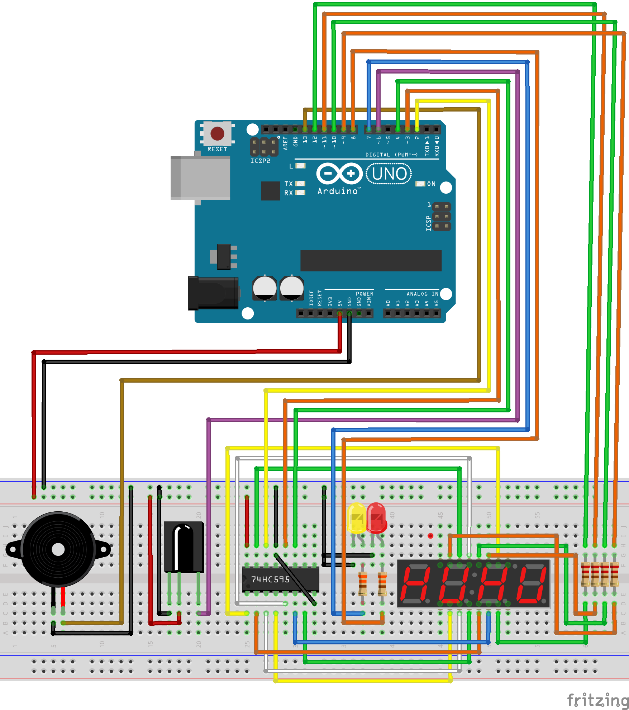

# IR Controlled Alarm Clock

## About
An alarm clock controlled by an IR remote without an RTC. A 74HC595 shift register is used to drive the 4-digit 7-segment display.

## Demo
https://youtu.be/keoGS6h-99Y

## Schematic

## Build

## Contact
Gaurav Garre: [gauravgarre@gmail.com](mailto:gauravgarre@gmail.com)

Project link: https://github.com/gauravgarre/ir-controlled-alarm-clock
